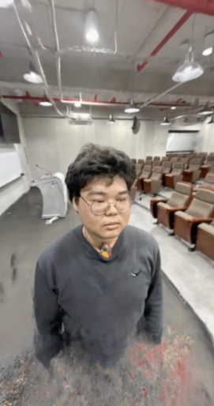
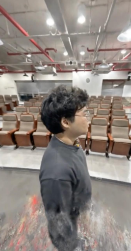
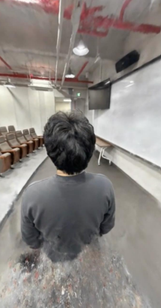

# Nerfstudio DokiDoki Minseok

Nerfstudio를 이용한 3D scene reconstruction 실험 프로젝트입니다.
기본 예제 데이터로 Nerfstudio 학습 및 렌더링 과정을 먼저 확인한 뒤, 직접 촬영한 이미지 데이터를 이용해 인물과 실내 공간을 복원했습니다.

---

## Overview

This project explores 3D scene reconstruction using **Nerfstudio**.

The experiment was conducted in two stages:

1. **Base Experiment**
   Reconstructed and rendered the default Nerfstudio sample scene to verify the training and rendering pipeline.

2. **Custom Reconstruction Experiment**
   Captured custom images using an iPhone 14 and reconstructed a scene containing a person, indoor background, and partially transparent objects such as glasses.

---

## Motivation

The custom experiment was motivated by the following questions:

* Can Nerfstudio reconstruct a human subject?
* How well does it reconstruct a more complex indoor background?
* How are transparent objects, such as glasses, reconstructed?
* What happens when the scene is captured only from partial viewpoints?

---

## Pipeline

The overall workflow is as follows:

1. Environment setup
2. Data capture
3. Data preprocessing
4. Nerfstudio training
5. Camera path setup
6. Rendering
7. Result analysis

---

## Results

### Reconstruction Images

  
  
  

The reconstructed scene shows the subject from multiple viewpoints.
The results demonstrate that Nerfstudio can reconstruct the overall human shape and indoor structure, although artifacts appear around the body boundary and lower region.

---

## Rendered Videos

### 1. Base Nerfstudio Experiment

This video shows the rendering result from the default Nerfstudio sample experiment.

https://github.com/alicex-x02/Nerfstudio_DokiDoki_Minseok/blob/main/assets/base.mp4

---

### 2. Custom Reconstruction Result

This is the first rendered result from the custom DokiDoki Minseok reconstruction experiment.
The output was successfully generated, but the video orientation was not correct.

https://github.com/alicex-x02/Nerfstudio_DokiDoki_Minseok/blob/main/assets/result_1.mp4

---

### 3. Rotated Final Result

This is the corrected version of the custom reconstruction result after rotating the rendered video to the proper orientation.

https://github.com/alicex-x02/Nerfstudio_DokiDoki_Minseok/blob/main/assets/result_2.mp4

---

## Presentation

The full presentation slide is available here:

[nerf_presentation.pdf](./docs/nerf_presentation.pdf)

---

## Tools

* Nerfstudio
* Python
* iPhone 14 camera
* Remote server environment

---

## Notes

This project was conducted as a small experimental study to understand the practical workflow of Nerfstudio-based 3D reconstruction, including data capture, preprocessing, training, camera path setup, and rendering.
